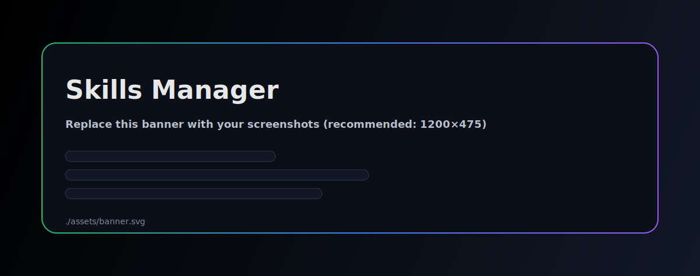
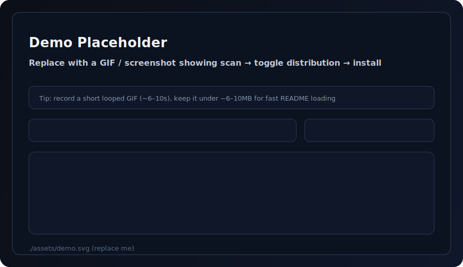

# Skills Manager

<p align="center">
  
</p>

A local “skills control plane” for AI coding agents: scan, centralize, and toggle distribution across tools.

[中文说明](README.zh.md)

## What it does

- One-click local scan & import: discover skills across agent directories and consolidate them into a single Manager Store (default: `~/.skillsm`)
- Per-agent toggles: enable/disable a skill for each agent (copy-based distribution: enable = copy into target directory, disable = remove from target directory)
- Marketplace install: install from GitHub repos (`owner/repo` / `github.com/owner/repo` / Git URL) or a `.zip` URL
- Configurable paths: Manager Store path and agent skills directories are customizable
- Full-sync progress UI: visible steps + progress logs during bulk sync
- Update all remote skills (planned): batch check & update installed skills from remote sources

## Demo

<p align="center">
  
</p>

## Why you might want this

If you use multiple tools (Codex / Claude Code / Cursor / Cline / Amp / Antigravity / OpenCode / Copilot, etc.), your skills often end up scattered across `~/.xxx/skills`. Skills Manager consolidates them into one place and lets you toggle distribution per agent without manual copying.

## How it works (high level)

1. **Scan & adopt**: scan agent skills directories, detect skill roots containing `SKILL.md`, and copy them into the Manager Store (`~/.skillsm` by default)
2. **Distribute**: toggling a skill for an agent copies the skill from the Manager Store into that agent’s skills directory; disabling removes that directory
3. **Uninstall**: removes the skill from the Manager Store and cleans up copies across agents (destructive, requires confirmation)

## Supported agents & default directories

| Agent | Default skills directory |
|---|---|
| Codex | `~/.codex/skills/` |
| Claude Code | `~/.claude/skills/` |
| Cursor | `~/.cursor/skills/` |
| Cline | `~/.cline/skills/` |
| OpenCode | `~/.opencode/skill/` |
| Copilot | `~/.copilot/skills/` |
| Amp | `~/.agents/skills/` |
| Antigravity | `~/.agent/skills/` |

> All paths are configurable in the app.

## Development

**Prerequisites**

- Bun or Node.js
- Rust toolchain (for Tauri)
- Tauri platform prerequisites (WebView / build toolchain)

```bash
# install deps
bun install

# start desktop dev
bun run tauri dev

# run tests
bun run test

# build frontend
bun run build
```

Rust tests:

```bash
cd src-tauri && cargo test
```

## Notes

- Marketplace install uses system tools: `git` for GitHub repos; `curl` + `unzip` for `.zip` URLs
- Distribution is copy-based (no symlinks). It uses more disk space, but stays stable across platforms.

## Roadmap

- [ ] Update all installed remote skills
- [ ] Backup export / import (migration to a new machine)
- [ ] Better skill detection (support “skill pack” repos)

## Contributing

Issues and PRs are welcome.
