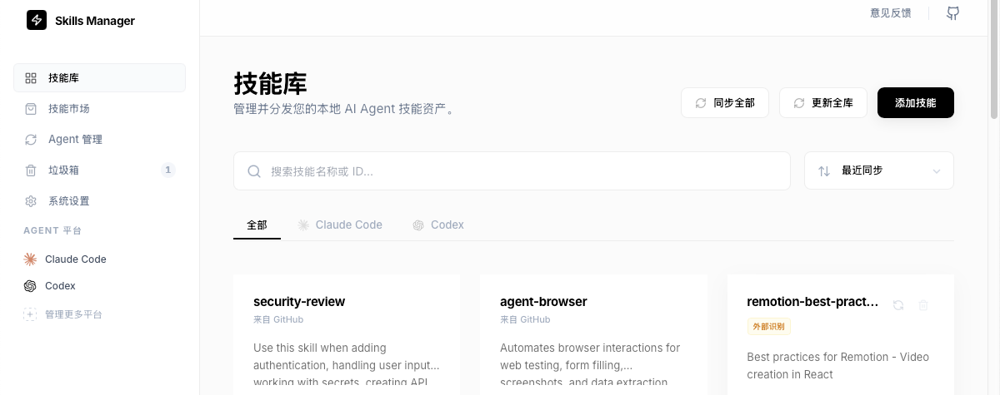

# Skills Manager

<p align="center">
  
</p>

本地多 Agent Skills 管理器：一键搜集、统一管理、按平台分发开关。

[English](README.md)

> 适合同时使用 Codex / Claude Code / Cursor / Cline / Amp / Antigravity / OpenCode / Copilot 等工具的人。

## 核心功能

- 一键搜集本地所有 Skills：扫描各平台默认 skills 目录，自动纳入中心库统一管理（默认 `~/.skillsm`）
- 按平台一键开关：每个 Skill 可以独立控制分发到哪些平台（采用「复制分发」，开启=复制到目标目录，关闭=从目标目录移除）
- Marketplace 一键安装：支持 GitHub 仓库（`owner/repo` / `github.com/owner/repo` / Git URL）或 `.zip` URL
- 路径可配置：中心库路径 + 各平台 skills 目录路径均可自定义
- 一键更新互联网 Skills（规划中）：批量检查与更新已安装的网络来源技能

## 演示

<p align="center">
  
</p>

## 亮点

- 本地优先：不需要登录、不开云端同步，技能源码/配置都留在你机器上
- 去重合并：多平台重复技能会被汇总到同一个中心库条目，避免“装了好几份不知道哪份在生效”
- 可视化进度：全量同步有进度与步骤日志，不卡在“黑盒等待”
- 跨平台桌面端：基于 Tauri + Rust，理论上可打包 macOS / Windows / Linux

## 它是怎么工作的？

1. **扫描并纳入中心库**：从各平台 skills 目录中识别包含 `SKILL.md` 的技能根目录，并复制到中心库（默认 `~/.skillsm`）
2. **按平台分发**：当你为某个 Skill 打开某个平台开关时，会把该 Skill 从中心库复制到该平台 skills 目录；关闭则移除对应目录
3. **卸载**：会删除中心库中的 Skill 目录，并清理所有平台目录中的副本（属于破坏性操作，会二次确认）

## 支持的平台与默认目录

| 平台 | 默认 skills 目录 |
|---|---|
| Codex | `~/.codex/skills/`（以及 `~/.codex/skills/.system/`） |
| Claude Code | `~/.claude/skills/` |
| Cursor | `~/.cursor/skills/` |
| Cline | `~/.cline/skills/` |
| OpenCode | `~/.opencode/skill/` |
| Copilot | `~/.copilot/skills/` |
| Amp | `~/.agents/skills/` |
| Antigravity | `~/.agent/skills/` |

> 以上路径都可以在 App 内修改。

## 开发与运行

**依赖：**

- Bun 或 Node.js
- Rust（用于 Tauri）
- 你的系统需要满足 Tauri 的平台依赖（WebView/构建工具链等）

```bash
# 安装依赖
bun install

# 启动桌面端开发模式
bun run tauri dev

# 运行测试
bun run test

# 构建前端
bun run build
```

Rust 侧单测：

```bash
cd src-tauri && cargo test
```

## 注意事项

- Marketplace 安装会调用系统命令：GitHub 仓库安装依赖 `git`；`.zip` 安装依赖 `curl` + `unzip`
- 目前默认采用「复制分发」，会占用一些额外磁盘空间（换来跨平台稳定性与低侵入）

## Roadmap

- [ ] 一键更新已安装的网络来源 Skills（更新全库）
- [ ] 导出/导入备份（迁移新电脑更轻松）
- [ ] 更强的技能识别（支持 skill pack、多技能仓库结构）

## 贡献

欢迎提 Issue / PR。也欢迎在 X 上晒你的工作流和技能库截图，让更多人少折腾。

## Star History

[](https://www.star-history.com/#d0ublecl1ck/skills-manager&type=date&legend=top-left)
