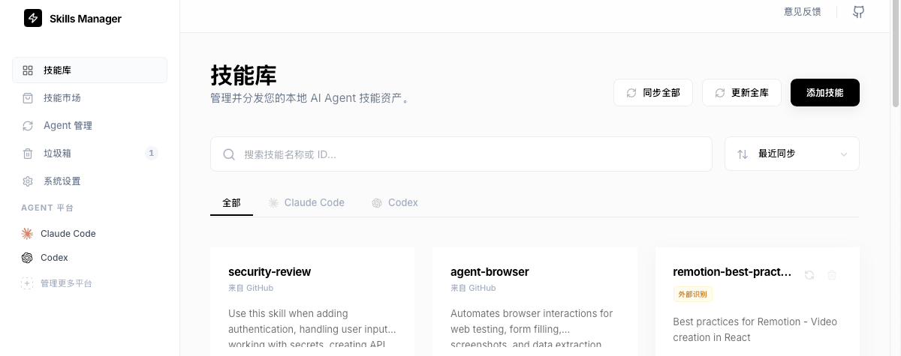

# Skills Manager

<p align="center">
  
</p>

<p align="center">
  <a href="https://github.com/d0ublecl1ck/skills-manager/releases/latest"></a>
  <a href="https://github.com/d0ublecl1ck/skills-manager/releases"></a>
  <a href="https://github.com/d0ublecl1ck/skills-manager/actions/workflows/pr-build.yml"></a>
  
  <a href="./LICENSE"></a>
</p>

**一个中心库管所有 agent 的 skill——复制式分发，不写符号链接，删装完全可逆。**

本地多 Agent Skills 管理器：一键搜集、统一管理、按平台分发开关。

[English](README.md) · [下载](#下载与安装) · [它是怎么工作的](#它是怎么工作的) · [支持的平台](#支持的平台与默认目录) · [开发与运行](#开发与运行)

> 适合同时使用 Codex / Claude Code / Cursor / Cline / Amp / Antigravity / OpenCode / Copilot 等工具的人。

## 核心功能

- 一键搜集本地所有 Skills：扫描各平台默认 skills 目录，自动纳入中心库统一管理（默认 `~/.skillsm`）
- 按平台一键开关：每个 Skill 可以独立控制分发到哪些平台（采用「复制分发」，开启=复制到目标目录，关闭=从目标目录移除）
- Marketplace 一键安装：支持 GitHub 仓库（`owner/repo` / `github.com/owner/repo` / Git URL）或 `.zip` URL
- 路径可配置：中心库路径 + 各平台 skills 目录路径均可自定义
- 一键更新互联网 Skills（规划中）：批量检查与更新已安装的网络来源技能

## 演示

<p align="center">
  
</p>

## 下载与安装

安装包在 [Releases 页面](https://github.com/d0ublecl1ck/skills-manager/releases/latest)，按平台选对应文件：

| 系统 | 文件 | 说明 |
|---|---|---|
| macOS（Apple Silicon） | `skills-manager_<version>_aarch64.dmg` | 打开 DMG，把应用拖进「应用程序」 |
| Windows | `skills-manager_<version>_x64-setup.exe` / `.msi` | 未签名构建，SmartScreen 可能提示确认 |
| Linux | `skills-manager_<version>_amd64.AppImage` / `.deb` / `.rpm` | AppImage 需先 `chmod +x` 再运行 |

构建产物**未做代码签名与公证**。macOS 首次启动若被 Gatekeeper 拦截，右键应用 → 打开，或执行：

```bash
xattr -dr com.apple.quarantine "/Applications/skills-manager.app"
```

`latest` 版本跟随 `master`：每次 release PR 合并后都会重新构建并覆盖发布。

## 亮点

- 本地优先：不需要登录、不开云端同步，技能源码/配置都留在你机器上
- 去重合并：多平台重复技能会被汇总到同一个中心库条目，避免“装了好几份不知道哪份在生效”
- 可视化进度：全量同步有进度与步骤日志，不卡在“黑盒等待”
- 跨平台桌面端：基于 Tauri + Rust，理论上可打包 macOS / Windows / Linux

## 它是怎么工作的？

1. **扫描并纳入中心库**：从各平台 skills 目录中识别包含 `SKILL.md` 的技能根目录，并复制到中心库（默认 `~/.skillsm`）
2. **按平台分发**：当你为某个 Skill 打开某个平台开关时，会把该 Skill 从中心库复制到该平台 skills 目录；关闭则移除对应目录
3. **卸载**：会删除中心库中的 Skill 目录，并清理所有平台目录中的副本（属于破坏性操作，会二次确认）

## 支持的平台与默认目录

Skills Manager 同时支持 **全局目录**（一般在 home 目录下）与 **项目目录**（一般在某个仓库内）。下面的默认值来自内置平台注册表，且都可以在 App 内修改。

| 平台 | 全局 skills 目录（默认） | 项目 skills 目录（默认） |
|---|---|---|
| Amp | `~/.config/agents/skills/` | `.agents/skills/` |
| Antigravity | `~/.gemini/antigravity/skills/` | `.agent/skills/` |
| Claude Code | `~/.claude/skills/` | `.claude/skills/` |
| Clawdbot | `~/.clawdbot/skills/` | `skills/` |
| Cline | `~/.cline/skills/` | `.cline/skills/` |
| CodeBuddy | `~/.codebuddy/skills/` | `.codebuddy/skills/` |
| Codex | `~/.codex/skills/`<br/>`~/.codex/skills/.system/` | `.codex/skills/` |
| GitHub Copilot | `~/.copilot/skills/` | `.github/skills/` |
| Cursor | `~/.cursor/skills/` | `.cursor/skills/` |
| Droid | `~/.factory/skills/` | `.factory/skills/` |
| Gemini CLI | `~/.gemini/skills/` | `.gemini/skills/` |
| Goose | `~/.config/goose/skills/` | `.goose/skills/` |
| Kilo Code | `~/.kilocode/skills/` | `.kilocode/skills/` |
| Kiro CLI | `~/.kiro/skills/` | `.kiro/skills/` |
| OpenCode | `~/.config/opencode/skills/` | `.opencode/skills/` |
| Qoder | `~/.qoder/skills/` | `.qoder/skills/` |
| Qwen Code | `~/.qwen/skills/` | `.qwen/skills/` |
| Roo Code | `~/.roo/skills/` | `.roo/skills/` |
| Trae | `~/.trae/skills/` | `.trae/skills/` |
| Windsurf | `~/.codeium/windsurf/skills/` | `.windsurf/skills/` |

> 以上路径都可以在 App 内修改。

## 开发与运行

**依赖：**

- Bun 或 Node.js
- Rust（用于 Tauri）
- 你的系统需要满足 Tauri 的平台依赖（WebView/构建工具链等）

```bash
# 安装依赖（任选一个包管理器）
bun install
# npm ci

# 启动桌面端开发模式
bun run tauri dev
# npm run tauri dev

# 运行测试
bun run test
# npm run test

# 门禁：任何被跟踪文件泄露个人绝对路径即失败
bun run guard:paths
# npm run guard:paths

# 由 remotion/ 里的 Remotion 合成重新渲染演示 GIF
npm run demo:render

# 构建前端
bun run build
# npm run build
```

Rust 侧单测：

```bash
cd src-tauri && cargo test
```

## 注意事项

- Marketplace 安装会调用系统命令：GitHub 仓库安装依赖 `git`；`.zip` 安装依赖 `curl` + `unzip`
- 目前默认采用「复制分发」，会占用一些额外磁盘空间（换来跨平台稳定性与低侵入）

## Roadmap

- [ ] 一键更新已安装的网络来源 Skills（更新全库）
- [ ] 导出/导入备份（迁移新电脑更轻松）
- [ ] 更强的技能识别（支持 skill pack、多技能仓库结构）

## 贡献

欢迎提 Issue / PR。也欢迎在 X 上晒你的工作流和技能库截图，让更多人少折腾。

## Star History

[](https://www.star-history.com/#d0ublecl1ck/skills-manager&type=date&legend=top-left)

## License

[MIT](./LICENSE)
